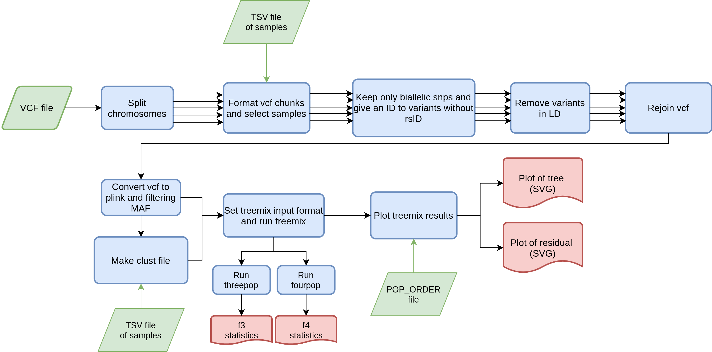

# nf-vcf2treemix
Nextflow pipeline that takes a pop vcf, runs and plots TreeMix

---

### Workflow overview


---


### Features
  **-v 0.0.1**

* Supports vcf compressed files as input.
* Results include a residual plot
* Parameters of TreeMix and filters with bcftools and plink could be changed in Nextflow config.
* Scalability and reproducibility via a Nextflow-based framework.

---

## Requirements
#### Compatible OS*:
* [Ubuntu 18.04.03 LTS](http://releases.ubuntu.com/18.04/)

\* nf-100GMX-variant-summarizer may run in other UNIX based OS and versions, but testing is required.

#### Software:
| Requirement | Version  | Required Commands * |
|:---------:|:--------:|:-------------------:|
| [bcftools](https://samtools.github.io/bcftools/) | 1.9-220-gc65ba41 | bcftools |
| [plink2](https://www.cog-genomics.org/plink/2.0/) | 2.0 | plink2 |
| [TreeMix](https://bitbucket.org/nygcresearch/treemix/downloads/) | 1.13 | treemix |
| [Python](https://www.python.org/downloads/) | Python 2.7.16 (at least) | - |
| [Nextflow](https://www.nextflow.io/docs/latest/getstarted.html) | 19.04.1.5072 | nextflow |
| [Plan9 port](https://github.com/9fans/plan9port) | Latest (as of 10/01/2019 ) | mk \** |
| [R](https://www.r-project.org/) | 3.4.4 | Rscript |

\* These commands must be accessible from your `$PATH` (*i.e.* you should be able to invoke them from your command line).  

\** Plan9 port builds many binaries, but you ONLY need the `mk` utility to be accessible from your command line.

---

### Installation
Download nf-vcf2treemix from Github repository:  
```
git clone hhttps://github.com/jbv2/nf-vcf2treemix.git
```

---

#### Test
To test nf-vcf2treemix execution using test data, run:
```
./runtest.sh
```

* NOTE: The test data residual can't be plotted.
Pipeline will start test, but it will fail in last module.
If you don't care to test residual plot, you can comment lines 27-29
of ```mk-plot-treemix/tree_plotter.R ````and run test.

    Your console should print the Nextflow log for the run, once every process has been submitted, the following message will appear:
    ```
    ======
    Nf-vcf2TreeMix: Basic pipeline TEST SUCCESSFUL
    ======
    ```
    Real data should not fail in making residual plot.

nf-vcf2treemix results for test data should be in the following file:
```
nf-vcf2treemix/test/results/nf-vcf2TreeMix-results
```

---

### Usage
To run nf-vcf2treemix go to the pipeline directory and execute:
```
nextflow run vcf2treemix.nf --vcffile <path to input 1> [--output_dir path to results ]
```

For information about options and parameters, run:
```
nextflow run vcf2treemix.nf --help
```

---

### Pipeline Inputs
* A compressed vcf file with extension '.vcf.gz'.
Example line(s):
```
##fileformat=VCFv4.2
#CHROM  POS     ID      REF     ALT     QUAL    FILTER  INFO
chr21	5101724	.	G	A	.	PASS	AC=1;AF=0.00641;AN=152;DP=903;ANN=A|intron_variant|MODIFIER|GATD3B|ENSG00000280071|Transcript|ENST00000624810.3|protein_coding||4/5|ENST00000624810.3:c.357+19987C>T|||||||||-1|cds_start_NF&cds_end_NF|SNV|HGNC|HGNC:53816||5|||ENSP00000485439||A0A096LP73|UPI0004F23660|||||||chr21:g.5101724G>A||||||||||||||||||||||||||||2.079|0.034663||||||||||||||||||||||||||||||||||||||||||||||||||||||||||||||||||||||||||||||||
chr21	5102165	rs1373489291	G	T	.	PASS	AC=1;AF=0.00641;AN=140;DP=853;ANN=T|intron_variant|MODIFIER|GATD3B|ENSG00000280071|Transcript|ENST00000624810.3|protein_coding||4/5|ENST00000624810.3:c.357+19546C>A|||||||rs1373489291||-1|cds_start_NF&cds_end_NF|SNV|HGNC|HGNC:53816||5|||ENSP00000485439||A0A096LP73|UPI0004F23660|||||||chr21:g.5102165G>T||||||||||||||||||||||||||||5.009|0.275409||||||||||||||||||||||||||||||||||||||||||||||||||||||||||||||||||||||||||||||||
```

---

* A file that contains name of samples and the group that belongs to, separated by " ". `(samples.txt)`

Example line(s):
```
sample1 Zoque
sample2 PEL
sample3 PEL
sample4 CHB
...
```

* A file that contains the order of pops that ypu wanted to be plotted `(pop_order)`. For more information about this file, please read Treemix documentation in [TreeMix](https://bitbucket.org/nygcresearch/treemix/wiki/Home).

### Pipeline Results
* The treeplot in a svg file.
* The residual plot in a svg file.

---

#### References
Under the hood nf-vcf-novel-dataset-builder uses some coding tools, please include the following ciations in your work:

* Narasimhan, V., Danecek, P., Scally, A., Xue, Y., Tyler-Smith, C., & Durbin, R. (2016). BCFtools/RoH: a hidden Markov model approach for detecting autozygosity from next-generation sequencing data. Bioinformatics, 32(11), 1749-1751.
* Team, R. C. (2017). R: a language and environment for statistical computing. R Foundation for Statistical Computing, Vienna. http s. www. R-proje ct. org.
* Purcell, S., Neale, B., Todd-Brown, K., Thomas, L., Ferreira, M. A., Bender, D., ... & Sham, P. C. (2007). PLINK: a tool set for whole-genome association and population-based linkage analyses. The American journal of human genetics, 81(3), 559-575.
Pickrell, J. K., & Pritchard, J. K. (2012). Supplementary Material for: Inference of population splits and mixtures from genome-wide allele frequency data.

---

### Contact
If you have questions, requests, or bugs to report, please email <judith.vballesteros@gmail.com> or <iaguilaror@gmail.com>

#### Dev Team
Israel Aguilar-Ordonez <iaguilaror@gmail.com>   
Judith Ballesteros-Villascán <judith.vballesteros@gmail>

