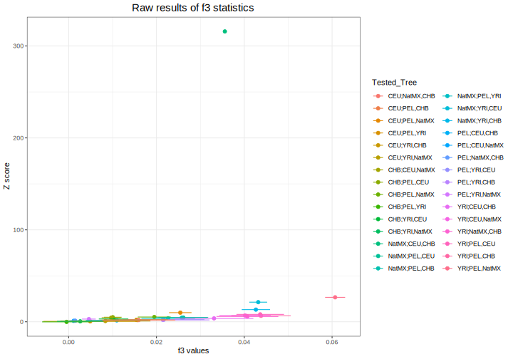
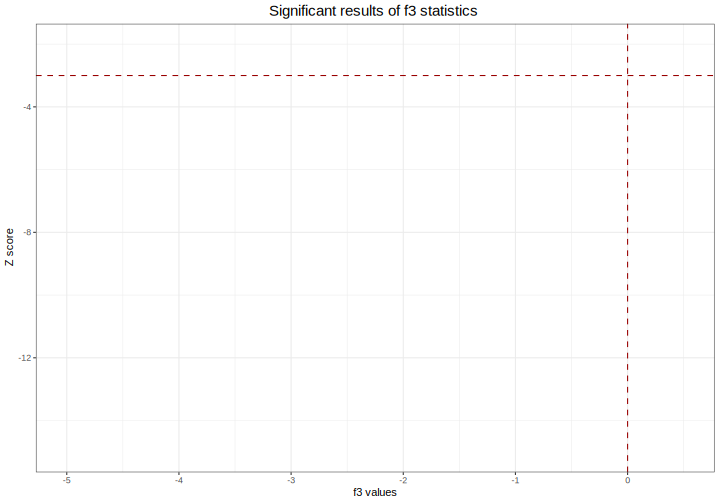

# mk-plot-f3statistics
**Author(s):**

* Judith Ballesteros Villascán (judith.vballesteros@gmail.com)

**Date:** March 2020 

---

## Module description:
Plots f3 statistics by using plotter.R

## Module Dependencies:
* plotter.R is a tool which indicates which are significant f3 results.

### Input(s):

* A `.f3statistics` file with f3 values with columns indicating:
[tested tree][f_3 statistic][standard error][Z-score]

Example line(s):

```
npop:5 nsnp:2826
Estimating covariance matrix in 2 blocks of size 1000
Estimating f_3 in 2 blocks of size 1000
total_nsnp 2826 nsnp 2826
Subgroup1;Subgroup2,Subgroup3 0.00490915 0.0106897 0.459241
Subgroup2;Subgroup1,Subgroup3 0.0216647 0.0092595 2.33973
...
```

### Outputs:

* A `.f3raw_plot.svg` file.


* A `.f3significant_plot` file.


## Module parameters:
NONE

## Testing the module:

1. Test this module locally by running,
```
bash testmodule.sh
```

2. `[>>>] Module Test Successful` should be printed in the console...

## mk-plot-f3statistics directory structure

````
mk-plot-f3statistics /				    ## Module main directory
├── mkfile						   		## File in mk format, specifying the rules for building every result requested by runmk.sh
├── readme.md							## This document. General workflow description.
├── runmk.sh								## Script to print every file required by this module
├── plotter.R					 ## Script used in this module.
├── test									## Test directory
│   ├── data								## Test data directory. Contains input files for testing.
└── testmodule.sh							## Script to test module functunality using test data
````
## References
* Pickrell, J. K., & Pritchard, J. K. (2012). Supplementary Material for: Inference of population splits and mixtures from genome-wide allele frequency data.
