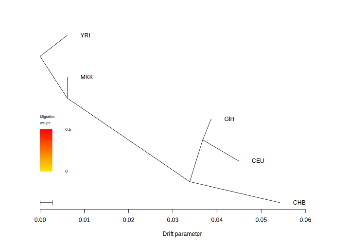
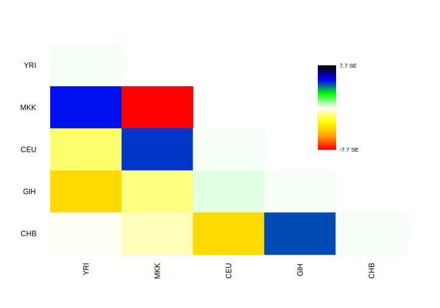

# mk-plot-treemix
**Author(s):**

* Judith Ballesteros Villascán (judith.vballesteros@gmail.com)

**Date:** March 2020 

---

## Module description:
Plots treemix output by using plotting_funcs.R

## Module Dependencies:
* plotting_funcs.R is a tool that uses the set of functions that treemix sugests to use for plotting.

### Input(s):

* Many `.TreeMix.*` files, default output of TreeMix.

### Outputs:

* A `.treeplot.svg` file.


* A `residual_plot.svg` file.



Example line(s):

```
Subgroup1 Subgroup2 Subgroup3 Subgroup4 Subgroup5 
2,64 45,113 36,124 0,152 53,153 
1,65 52,106 43,117 0,152 80,126 
0,66 9,149 1,159 0,152 33,173
...
```

## Module parameters:
Path to pop_order file:

POP_ORDER="test/reference/pop_order"

## Testing the module:

1. Test this module locally by running,
```
bash testmodule.sh
```

2. `[>>>] Module Test Successful` should be printed in the console...

## mk-plot-treemix directory structure

````
mk-plot-treemix /				    ## Module main directory
├── mkfile						   		## File in mk format, specifying the rules for building every result requested by runmk.sh
├── readme.md							## This document. General workflow description.
├── runmk.sh								## Script to print every file required by this module
├── plotting_funcs.R					 ## Script used in this module.
├── test									## Test directory
│   ├── data								## Test data directory. Contains input files for testing.
└── testmodule.sh							## Script to test module functunality using test data
````
## References
* Pickrell, J. K., & Pritchard, J. K. (2012). Supplementary Material for: Inference of population splits and mixtures from genome-wide allele frequency data.
